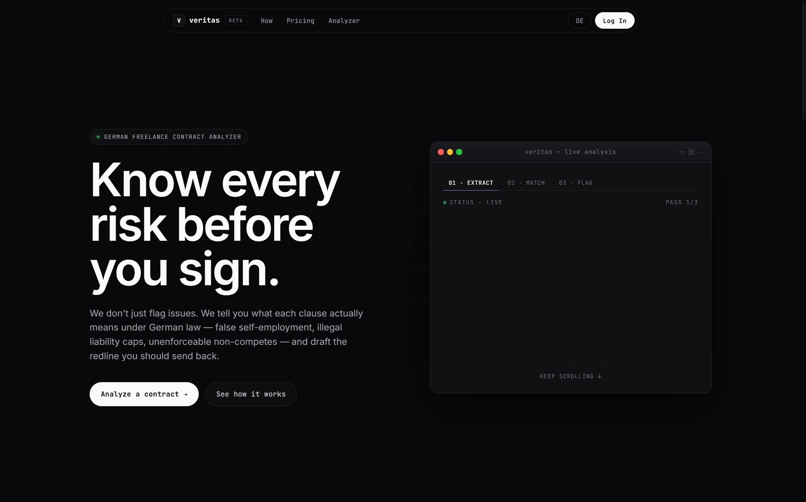
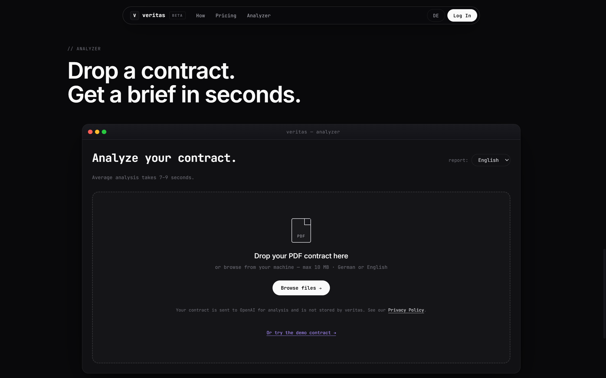
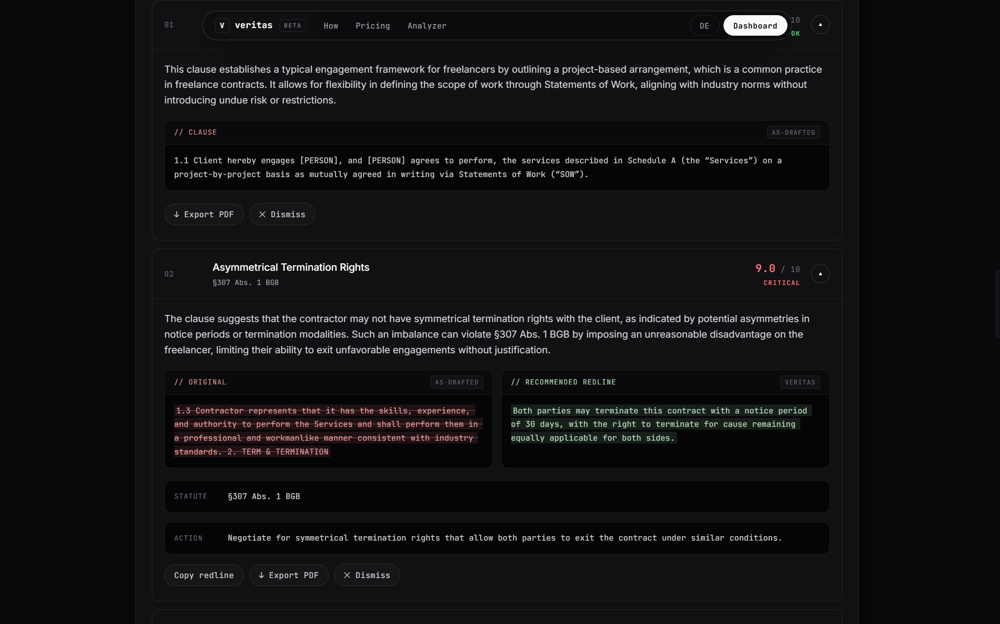
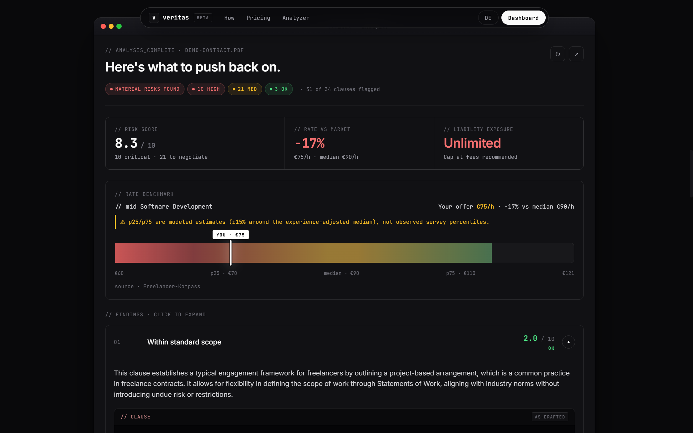
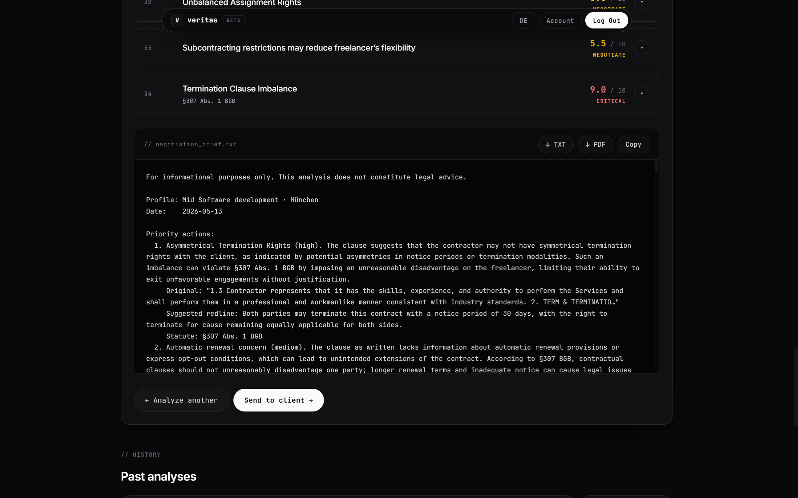

# Veritas — German Freelance Contract Analyzer

> AI-powered risk analysis for German freelance contracts. Grounded in statute, not just pattern-matching.

**Live app → [veritas-demo.web.app](https://veritas-demo.web.app)**



---

## What it does

Veritas reads a German freelance contract (PDF), runs every clause through a three-layer legal-knowledge stack, and returns a ranked list of risks — each with a statute citation, a plain-language explanation, and a concrete redline you can paste into your reply. It also benchmarks the offered hourly rate against market data and flags patterns like Scheinselbstständigkeit (false self-employment) that individual clause review would miss.

Key properties:

- **Statute-grounded** — every high/medium finding cites a specific BGB, SGB IV, UrhG, or GewO paragraph
- **No LLM rewriting of legal text** — clauses are split deterministically in Python; the LLM never paraphrases source text before vector search
- **GDPR-first** — names, company names, and IBANs are redacted on-device by Microsoft Presidio before any text reaches OpenAI
- **Bilingual** — analysis and output in English or German, selectable per report

---

## Screenshots

| Drop zone | Analysis results |
|---|---|
|  |  |

| Rate benchmark bar | Negotiation brief |
|---|---|
|  |  |

---

## Architecture

The pipeline has three knowledge layers plus a generation layer:

```
PDF upload
    │
    ▼
┌─────────────────────────────────────────────────┐
│  Layer 0 — Extraction & Redaction               │
│  pdfplumber → Presidio PII redaction → chunking │
│  (deterministic regex split, no LLM rewriting)  │
└───────────────────┬─────────────────────────────┘
                    │ verbatim clauses
         ┌──────────┼──────────┐
         ▼          ▼          ▼
┌──────────────┐  ┌──────────────────┐  ┌──────────────────┐
│  Layer 1     │  │  Layer 2          │  │  Layer 1         │
│  Statute DB  │  │  Playbook         │  │  Rate benchmarks │
│  (Firestore) │  │  66 curated       │  │  (Firestore)     │
│  BGB/SGB IV/ │  │  risky-clause     │  │  p25/median/p75  │
│  UrhG/GewO   │  │  patterns +       │  │  by skill/exp/   │
│              │  │  vector search    │  │  region          │
└──────┬───────┘  └────────┬─────────┘  └──────┬───────────┘
       └──────────────┬────┘                    │
                      ▼                         │
            ┌─────────────────────┐             │
            │  Layer 3 — LLM      │◄────────────┘
            │  gpt-4o             │
            │  structured output  │
            │  (Finding schema)   │
            └─────────┬───────────┘
                      ▼
            ┌─────────────────────┐
            │  Report assembly    │
            │  Dedup · sort ·     │
            │  brief · snapshot   │
            └─────────┬───────────┘
                      ▼
               Firestore + UI
```

**Concurrency model:** playbook vector searches (Phase A), statute lookups (Phase B), and LLM synthesis calls (Phase C) all run concurrently with `asyncio.gather`. A 15-clause contract typically completes in 7–9 seconds.

---

## Tech stack

| Layer | Technology |
|---|---|
| Backend | FastAPI · Python 3.11 · Cloud Run (europe-west1) |
| Database | Firebase Firestore (`contractdb`) with native vector search |
| Frontend | Vanilla HTML / JS / CSS · Firebase Hosting |
| Auth | Firebase Auth (Google OAuth + email/password) |
| Embeddings | OpenAI `text-embedding-3-small` (1536-dim, cosine) |
| LLM | OpenAI `gpt-4o` (clause analysis) · `gpt-4o-mini` (metadata extraction) |
| PII redaction | Microsoft Presidio + spaCy (`de_core_news_sm`, `en_core_web_sm`) |
| OCR fallback | Google Cloud Document AI (scanned PDFs) |
| Rate limiting | slowapi (10 req/min) |
| Retries | tenacity (exponential backoff, 3 attempts) |
| PDF export | jsPDF (client-side) |

---

## Project structure

```
.
├── app/
│   ├── main.py                      # FastAPI app, auth middleware, quota enforcement
│   └── services/
│       ├── ingestion.py             # PDF extraction, PII redaction, clause chunking, metadata LLM
│       ├── clause_analyzer.py       # RAG orchestration, Finding schema, deduplication
│       ├── redaction.py             # Presidio + spaCy PII redaction (on-device)
│       └── report_builder.py        # Assembles AnalysisReport, negotiation brief
├── db/
│   ├── playbook_lookup.py           # Firestore vector search over 66-entry playbook
│   ├── rate_lookup.py               # Rate benchmark lookup with skill/experience/region matching
│   ├── statute_lookup.py            # Statute reference cache
│   ├── seed_playbook.sql            # 66 curated risky-clause patterns (source of truth)
│   └── seed_rates.sql               # Rate benchmark data (Freelancer-Kompass 2025)
├── frontend/
│   ├── index.html                   # Landing page, pricing, analyzer, auth modal
│   ├── app.js                       # Analysis flow, results rendering, i18n (EN/DE)
│   ├── dashboard.html               # Past analyses dashboard
│   ├── dashboard.js                 # Dashboard rendering, analysis history
│   ├── auth.js                      # Firebase Auth UI
│   ├── style.css                    # Design system (dark terminal theme)
│   └── sample-contract.pdf          # Bundled demo contract
├── scripts/
│   ├── seed_firestore.py            # Seeds rate_benchmarks collection
│   ├── parse_and_seed_firestore.py  # Parses SQL playbook → Firestore + embeddings
│   └── seed_vectors.py             # Re-embeds playbook (use when changing embedding model)
├── tests/
│   ├── test_analyze_endpoint.py     # Integration test (mocked external services)
│   └── evaluation/
│       ├── gold_set.json            # 10 annotated clauses with expected risk/statute/keywords
│       └── run_eval.py              # Precision/recall evaluation runner
├── Dockerfile                       # Python 3.11-slim, exposes 8080
├── startup.py                       # Uvicorn entrypoint (sets sys.path for Cloud Run)
├── firebase.json                    # Hosting config (site: veritas-demo)
└── requirements.txt
```

---

## Local setup

### Prerequisites

- Python 3.11+
- A Google Cloud project with Firestore enabled (database ID: `contractdb`)
- Firebase CLI: `npm install -g firebase-tools`
- An OpenAI API key

### 1 — Clone and install

```bash
git clone <repo-url>
cd advanced-ml-group-project

python3.11 -m venv .venv
source .venv/bin/activate
pip install -r requirements.txt
```

### 2 — Environment variables

Create a `.env` file in the project root:

```bash
OPENAI_API_KEY=sk-...

# Google Cloud Document AI (optional — only needed for scanned PDF fallback)
PROJECT_ID=your-gcp-project-id
LOCATION=eu
PROCESSOR_ID=your-processor-id
```

Download your Firebase service account key from Google Cloud Console → IAM → Service Accounts and save it as `firebase-adminsdk.json` in the project root.

### 3 — Seed the database

Run once to populate Firestore with rate benchmarks and the playbook vectors:

```bash
# Rate benchmarks (rate_benchmarks collection)
python scripts/seed_firestore.py

# Playbook: parse SQL → generate embeddings → insert into Firestore
python scripts/parse_and_seed_firestore.py
```

The seeding scripts embed all 66 playbook entries using `text-embedding-3-small` and store them in the `playbook` collection with a 1536-dim vector field. This takes ~30 seconds and costs less than $0.01 in OpenAI embedding credits.

### 4 — Run locally

Open two terminals:

```bash
# Terminal 1 — backend
source .venv/bin/activate
uvicorn app.main:app --reload
# → http://localhost:8000

# Terminal 2 — frontend
python -m http.server 3000 --directory frontend/
# → http://localhost:3000
```

`frontend/config.js` auto-detects `localhost` and points to `http://localhost:8000` — no manual config needed.

---

## Cloud deployment

### Backend — Google Cloud Run

```bash
gcloud run deploy contract-analyzer \
  --source . \
  --region europe-west1 \
  --set-env-vars OPENAI_API_KEY="sk-..." \
  --set-env-vars PROJECT_ID="your-project" \
  --set-env-vars LOCATION="eu" \
  --allow-unauthenticated
```

The container runs `startup.py`, which sets `sys.path` before launching uvicorn on port 8080.

For production, store secrets in Secret Manager rather than inline env vars:

```bash
gcloud secrets create openai-api-key --data-file=- <<< "sk-..."
gcloud run deploy contract-analyzer \
  --set-secrets OPENAI_API_KEY=openai-api-key:latest \
  ...
```

### Frontend — Firebase Hosting

```bash
firebase deploy --only hosting
# → https://veritas-demo.web.app
```

`firebase.json` targets the `veritas-demo` site under the `veritas-43d91` project. All routes rewrite to `index.html` (SPA behaviour).

---

## Evaluation

The `tests/evaluation/` directory contains a gold annotation set and an evaluation runner for measuring analysis quality.

### Gold set

`tests/evaluation/gold_set.json` — 10 clauses across 6 risk categories (Scheinselbstständigkeit, IP transfer, liability, payment terms, non-compete, confidentiality), each annotated with:

- Expected risk tier (`high` / `medium` / `low`)
- Required statute substrings (e.g. `["§ 7", "SGB IV"]`)
- Keywords that must appear in the finding title or body

### Running the evaluation

```bash
# Direct mode — imports the pipeline (requires env vars set)
python tests/evaluation/run_eval.py

# HTTP mode — calls a running server
python tests/evaluation/run_eval.py \
  --mode http \
  --url https://contract-analyzer-twcbgtbasa-ew.a.run.app \
  --token <firebase-id-token>
```

Sample output:

```
────────────────────────────────────────────────────────────────────────
ID         CAT                       EXP      GOT      RISK STAT  KW
────────────────────────────────────────────────────────────────────────
GS-001     scheinselbststaendigkeit  high     high     ✓    ✓     ✓
GS-002     intellectual_property     high     high     ✓    ✓     ✓
GS-003     liability                 high     high     ✓    ✓     ✓
...
────────────────────────────────────────────────────────────────────────
Risk-tier accuracy : 90%  (9/10)
Statute hit rate   : 80%  (8/10)
Keyword hit rate   : 100% (10/10)
Overall precision  : 90%
────────────────────────────────────────────────────────────────────────
✓ PASS  (threshold: 70%)
```

Exits with code 0 if overall precision ≥ 70%, code 1 otherwise (CI-friendly).

---

## Key design decisions

**Why deterministic clause chunking instead of LLM splitting?**
The LLM is used for legal synthesis, not for touching the source text before it reaches the vector index. A regex split on blank lines, § markers, and numbered sub-clauses is byte-for-byte reproducible and eliminates the risk of the LLM subtly paraphrasing a clause in a way that shifts its embedding away from the matching playbook entry.

**Why on-device PII redaction?**
GDPR data-minimisation: the freelancer's name, their client's company name, and their IBAN should not leave the server. Presidio + spaCy runs in a thread pool before any OpenAI call. German NER (`de_core_news_sm`) redacts PERSON, ORGANIZATION, and IBAN_CODE. English NER (`en_core_web_sm`) is scoped to PERSON and IBAN only — the English model over-triggers ORGANIZATION on capitalized contract terms like "VAT" and "Cap".

**Why Firestore instead of pgvector?**
Firestore's native `find_nearest` with cosine distance eliminates a separate vector database while keeping the document store, auth, and hosting in the same project. At 66 playbook entries, brute-force cosine search is fast enough and the managed infrastructure reduces operational overhead.

**Why split gpt-4o / gpt-4o-mini across tasks?**
Metadata extraction (5 scalar fields from contract text) is a simple structured-output task where gpt-4o-mini is fast and sufficient. Clause analysis carries a 10-rule system prompt (language enforcement, anti-hallucination, risk calibration, statute citation format) where instruction-following quality matters — gpt-4o is used here for better rule compliance and lower hallucination rates on statute paragraph numbers.

---

## GDPR & legal disclaimer

- Contract text is sent to OpenAI's API for analysis after on-device PII redaction. See the [Privacy Policy](https://veritas-demo.web.app) in the app footer.
- Analysis results are stored in Firestore under the authenticated user's UID and can be deleted at any time via the dashboard.
- **This tool does not provide legal advice.** Findings are informational. Engage a Fachanwalt für Arbeitsrecht for binding legal assessment.

---

## Built at Nova SBE

Developed as a capstone project for *2758-T4 Advanced Topics in Machine Learning* at Nova School of Business and Economics, 2026.
